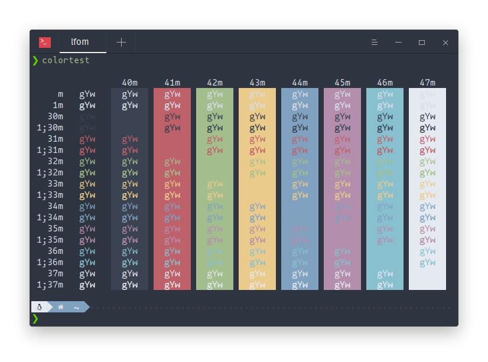

# deepin-nord
A [Nord](https://www.nordtheme.com/) color theme for [Deepin Terminal](https://github.com/linuxdeepin/deepin-terminal) based on the [nord-termite](https://github.com/arcticicestudio/nord-termite) version.

## Install

1) `git clone https://github.com/lfom/deepin-nord.git`
2) `cd deepin-nord && chmod +x install.sh && ./install.sh`
3) Restart your terminal
4) Select `nord` from the `Themes` tab
5) Done!

## Acknowledgement
Installer and README based on [deepin-snazzy](https://github.com/xxczaki/deepin-snazzy) by [@xxczaki](https://github.com/xxczaki).

## License

MIT © [lfom](https://lfom.tk)